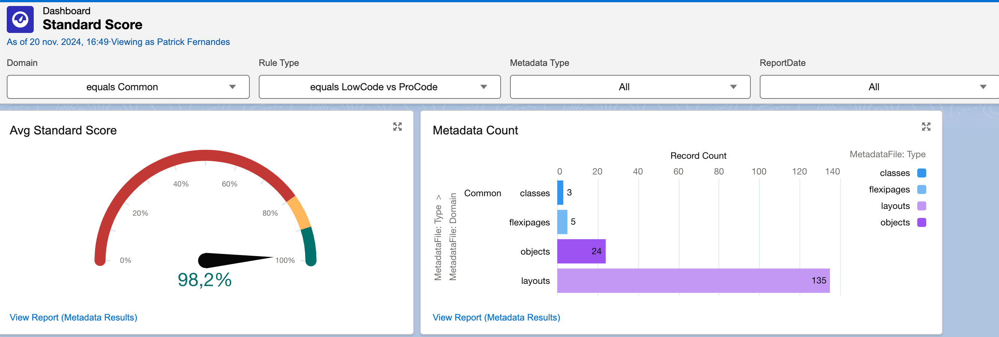
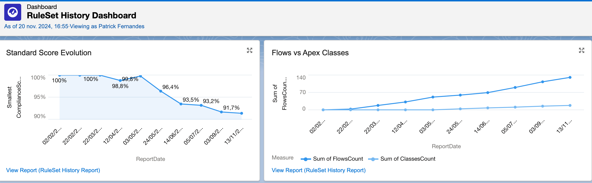

# PAT Custom Tracker

This tool allows users to take advantage of **PMD code analysis** engine (Currently v6.55.0) to follow up **ProCode vs LowCode** ratio compliance. This repo contains:
- SObject data model for storing metrics
- Salesforce Application to navigate
- PermissionSets to grant access
- Shell scripts to perform all tasks from starting the analysis to publishing the results

# Disclaimer

**PAT Custom Tracker** is not an official Salesforce product, it has not been officially tested or documented by Salesforce.

## How to setup PAT Custom Tracker ?

The configuration is based on the following topics:
- Metadata File Domains
- Pro Code vs Low Code XPathRules
- Reports and Dashboards

### Metadata File Domains

Each metadata file can be associated with a Domain, this allows to track the ratio of ProCode vs LowCode on each domain. Some domains are pre-created: `Common`, `Framework` and `Test`:
- To add new domains configure the `MetadataFile.Domain__c` picklist.

### Pro Code vs Low Code XPathRules

Several improvements are planned but currently the distribution **ProCode vs LowCode** is quite binary.
By default, the following Metadata are considered LowCode:
- `ApprovalProcess`
- `FlexiPage` (Lightning Page)
- `Flow`
- `Layout`
- `CustomObject`
- `Workflow`

By default, the following Metadata are considered ProCode:
- `AuraDefinitionBundle` (Aura Component)
- `ApexClass`
- `LightningComponentBundle` (Lightning Web Component)
- `ApexPage` (Visualforce)

You can modify or add new metadata to be distributed by editing the `custom-vs-standard-ruleset.xml` file
- include the new metadata folder

Flow and Apex metadata folders examples
``` xml
   <include-pattern>.*/flows/.*</include-pattern>
   <include-pattern>.*/classes/.*</include-pattern>
```
- add PMD XPathRules

Flow and Apex XPathRule examples
``` xml
  <rule name="LowCode Flow" language="xml" message="Flow metadata" class="net.sourceforge.pmd.lang.rule.XPathRule">
    <priority>5</priority>
    <properties>
      <property name="version" value="2.0"/>
      <property name="xpath"><value><![CDATA[
        //Flow[count(//Flow) = 1]
      ]]></value></property>
    </properties>
  </rule>
  <rule name="ProCode ApexClass" language="xml" message="Apex Class metadata" class="net.sourceforge.pmd.lang.rule.XPathRule">
    <priority>1</priority>
    <properties>
      <property name="version" value="2.0"/>
      <property name="xpath"><value><![CDATA[
        //ApexClass[count(//ApexClass) = 1]
      ]]></value></property>
    </properties>
  </rule>
```
 > Nota:
    - `<priority>5</priority>` means 100% compliance with LowCode objective
    - `<priority>1</priority>` means 0% compliance with LowCode objective (or 100% ProCode)

### Reports and Dashboards
The following reports are pre-configured:
- `Metadata Results`
- `Metadata Files Report`
- `RuleSet MetadataFile Report`
- `MetadataFile Compliance Report`
- `MetadataFile Type Rule Report`
- `RuleSet History Report`

The following dashboards are pre-configured:
- `Priority Score` (Overview dashboard used on the application Home Page)
- `Compliance Score` (Global Compliance focus, cross-RuleType: Security, Design, ProCode vs LowCode, ...)
- `Standard Score` (Compliance Score by Domain and RuleType, **useful to focus on ProCode vs LowCode from a particular domain**)
[](./docs/screenshots/standard-score.png)

- `RuleSet History Dashboard` (Compliance Score History)
[](./docs/screenshots/ruleset-history-dashboard.png)

## Deploy to Salesforce

Checkout the repo and deploy it with Salesforce CLI (sfdx):
```sh
sf project deploy start --target-org <org_username> --source-dir force-app
```

Use GitHub Salesforce Deploy Tool:
[](https://githubsfdeploy.herokuapp.com/?owner=patferna-sfdx&repo=pat-custom-tracker&ref=main)

## Quick Start
- Deploy **PAT Custom Tracker** (this repo) to a Developer sandbox using **Salesforce CLI** or **GitHub Salesforce Deploy**
- Grant yourself the Permission Set `PatCustomTrackerAdmin`
- With VSCode retrieve from a sandbox the metadata to be analyzed via a manifest `package.xml` file or by positioning on the development branch of your Git project
   > Nota: Be careful to keep the following files locally after a `git checkout`
    - `run-1-extract.sh`
    - `run-2-transform.sh`
    - `run-3-dataload.sh`
    - `custom-vs-standard-ruleset.xml`
    - `transform/CREATE_TABLES.sql`
    - `transform/TRANSFORM.sql`
 - Run the following Shell scripts in order
   > Nota: The following files will be generated
    - `transform/in/PmdReport.csv`
    - `transform/in/CpdReport.csv`
    - `transform/out/1_MetadataFile__c.csv`
    - `transform/out/2_RuleSetResult__c.csv`
    - `transform/out/3_RuleResult__c.csv`
```sh
sh run-1-extract.sh
sh run-2-transform.sh
sh run-3-dataload.sh
```
 - Go to **PAT Custom Tracker** application on the sandbox
 - Set the value of the Domain field of the metadata file records if necessary
 - Use the existing report and dashboard or feel free to create new ones (It is better to create new Reports and Dashboards in order to facilitate possible updates of the tool in the future.)
